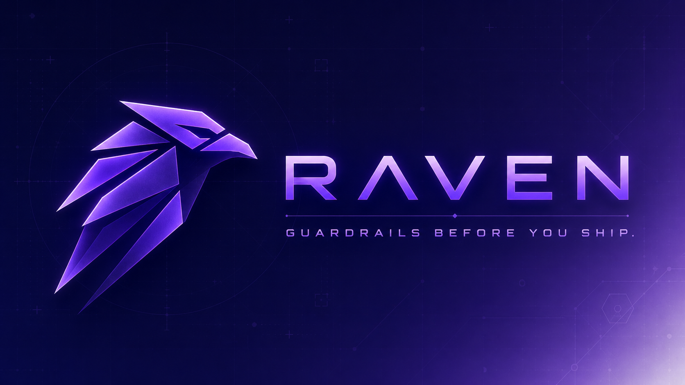

<p align="center">
  
</p>

# Raven Guard

> Claude Code implementation of the Raven production protection layer.
> Part of the [Raven platform](https://github.com/giggsoinc/raven-core). MIT License.
> Built by [Giggso Inc](https://github.com/giggsoinc).

*Guardrails before you ship.*

---

## What Is This?

Raven Guard is the production protection layer — a separate product from Raven Core.

| | Raven Core | Raven Guard |
|---|---|---|
| **Audience** | Developers | DevOps, Architects, Security |
| **Job** | Coding discipline | Production protection |
| **Triggers** | Dev actions | System events |
| **Blocks** | Bad code patterns | Destructive operations |

---

## The 6 Guard Agents

| Agent | Watches | Hard Blocks | Approval Flow |
|---|---|---|---|
| guard-git-watch | Deletions, force push, config | Force push, config wipe | Flagged deletions |
| guard-db-watch | Truncations, mass deletes, schema | TRUNCATE, DROP | >100 rows, index delete |
| guard-infra-watch | Terraform, S3, VMs, network | State file, destroy | S3 delete, VM terminate |
| guard-observability-watch | Logs, metrics, access patterns | — | P1 page, P2 email |
| guard-firewall-watch | Firewall rules, ports, egress | 0.0.0.0/0, RDP, SSH public | Rule changes |
| guard-incident-manager | All Guard alerts | — | P1/P2/P3 + SLA |

---

## How It Works

```
System event detected (git push, DB query, infra change, firewall rule)
      ↓
Guard agent fires
      ↓
Destructive? → HARD BLOCK + escalation
Approval needed? → Email Prism7 + auto PR
      ↓
First responder approves/rejects
      ↓
Full audit trail in Git history
```

---

## Intentional Deletions

```bash
git commit -m "refactor: remove legacy module [GUARD:ALLOW-DELETE]"
```

Triggers approval flow instead of hard block.

---

## Incident Severity

| Level | SLA | Who Gets Notified |
|---|---|---|
| P1 Critical | 15 min | Escalation contact SMS + Prism7 CRITICAL |
| P2 High | 1 hour | Prism7 HIGH + team lead |
| P3 Medium | 24 hours | Prism7 daily digest |

---

## Audit Trail

All events encrypted and compressed → S3 / GCS / Azure Blob / OCI:

```
s3://bucket/raven/{project}/{dev}/{github_id_or_tag}/{date}.log.gz.enc
```

---

## Install

```bash
cd YourProject
bash ../raven-guard/raven-guard-setup.sh
```

Requires [Raven Core](https://github.com/giggsoinc/raven) installed first.

---

## License

MIT — [Giggso](https://giggso.com)
