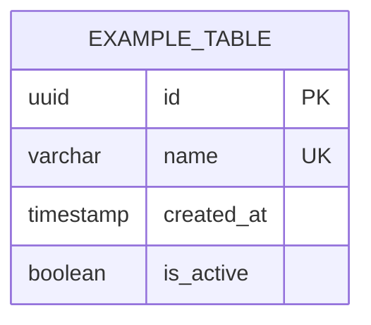

# ERD — [Project Name]

> Maintained by db-specialist. Update after every schema change.
> Tool: Mermaid (default) | draw.io | dbdiagram.io | ERDPlus

## Migration Log

| File | Change | Date |
|---|---|---|
| 00_init.sql | Initial schema | — |

## Access Patterns (required for DynamoDB / NoSQL)

| Pattern | PK | SK | GSI |
|---|---|---|---|
| — | — | — | — |
